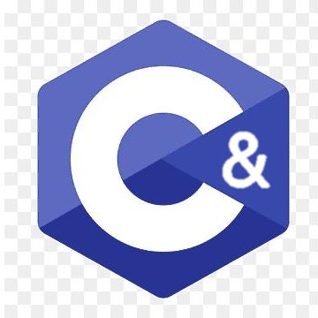

# Cathon Programming Language

## Overview
Cathon is a lightweight, self-designed programming language, 
which combines the syntax characteristics of C and Python. 
It features simple grammar, easy learning and fast compilation, 
suitable for daily development, small tool making and programming learning.

## Language Features
- Mixed style of C-like static syntax and Python-like concise writing
- One-click compilation, friendly error prompt
- Support cross-platform running on Windows, Linux and Android
- Can be called with C++ / Python / DLL / SO library
- Low learning cost, suitable for beginners and custom development

## Compilation & Usage
1. Write source code with Cathon official syntax
2. Use one-click compile command to generate executable file
3. Support hiding program files to avoid reference path errors
4. Deploy related web pages to Netlify for online display

## Application Scenarios
- Small desktop tools development
- Web front-end background interaction
- Mobile lightweight programming practice
- Personal custom language research and learning

## Advantage
Compared with traditional programming languages, 
Cathon is more flexible in syntax, faster in compilation, 
and avoids cumbersome configuration. 
It can be embedded into HTML and combined with local index.html to build independent applications.